# GPU-enabled Anaconda3 and JupyterLab in Docker

## About

GPU-enabled Docker containers with Anaconda 3 and Jupyter Lab for students wanting to run their instances using Portainer on LTFE AI Server. Skip to [Running on Portainer](#running-on-portainer) section for quick start.

Note:

> ⚡ This project is a fork of [xychelsea/anaconda3-docker](https://github.com/xychelsea/anaconda3-docker).
> Small dependency version updates have been made to adapt it for students lab use in early 2025.

Current version:

> ✅ Currently uses Ubuntu 24.04, CUDA 12.6, Python 3.12, and Conda 24.11.3.

### What is this?

Provides an [NVIDIA GPU-enabled](https://hub.docker.com/r/nvidia/cuda) container with a lightweight (Miniconda) [Anaconda](https://anaconda.com/) installation. Anaconda is an open data science platform based on Python 3. This container installs Anaconda into the `/usr/local/anaconda` directory. The default user, `anaconda` runs a [Tini shell](https://github.com/krallin/tini/) `/usr/bin/tini`, and comes preloaded with the `conda` command in the environment `$PATH`. Additional versions with [NVIDIA/CUDA](https://hub.docker.com/r/nvidia/cuda/) support and [Jupyter Notebooks](https://jupyter.org/) tags are available.

### What does it feature?

This container enables the `conda` command with a lightweight version of Anaconda (Miniconda) and the `conda-forge` [repository](https://conda-forge.org/) in the `/usr/local/anaconda` directory. The default user, `anaconda` runs a [Tini shell](https://github.com/krallin/tini/) `/usr/bin/tini`, and comes preloaded with the `conda` command in the environment `$PATH`. Additional versions with [NVIDIA/CUDA](https://hub.docker.com/r/nvidia/cuda/) support and [Jupyter Notebooks](https://jupyter.org/) tags are available.

### What about GPU support?

Two flavors provide an [NVIDIA GPU-enabled](https://hub.docker.com/r/nvidia/cuda) container with [Anaconda](https://anaconda.com/).

## Getting the containers

### Vanilla Anaconda and Jupyter

The base container, based on the `ubuntu:latest` from [Ubuntu](https://hub.docker.com/_/ubuntu/) running a Tini shell. For the container with a `/usr/bin/tini` entry point, use:

```bash
docker pull matejrabzelj/anaconda3:latest
```

With Jupyter Notebooks server pre-installed, pull with:

```bash
docker pull matejrabzelj/anaconda3:latest-jupyter
```

### Anaconda and Jupyter with NVIDIA/CUDA GPU support

Modified version of `nvidia/cuda:latest` container, with support for NVIDIA/CUDA graphical processing units through the Tini shell. For the container with a `/usr/bin/tini` entry point:

```bash
docker pull matejrabzelj/anaconda3:latest-gpu
```

With Jupyter Notebooks server pre-installed, pull with:

```bash
docker pull matejrabzelj/anaconda3:latest-gpu-jupyter
```

## Running the containers

### Running using Docker CLI

To run the containers with the generic Docker application or NVIDIA enabled Docker, use the `docker run` command. Make sure you have installed the [NVIDIA driver](https://docs.nvidia.com/cuda/cuda-installation-guide-linux/) and [NVIDIA Container Toolkit](https://github.com/NVIDIA/nvidia-container-toolkit) beforehand.

#### Vanilla Anaconda and Jupyter

```bash
docker run --rm -it matejrabzelj/anaconda3:latest
```

With Jupyter Notebooks server pre-installed, run with:

```bash
docker run --rm -it -d -p 8888:8888 matejrabzelj/anaconda3:latest-jupyter
```

#### Anaconda and Jupyter with NVIDIA/CUDA GPU support

```bash
docker run --gpus all --rm -it matejrabzelj/anaconda3:latest-gpu /bin/bash
```

With Jupyter Notebooks server pre-installed, run with:

```bash
docker run --gpus all --rm -it -d -p 8888:8888 matejrabzelj/anaconda3:latest-gpu-jupyter
```

## Running using Compose

You can run the desired containers using the provided `docker-compose.*.yml` sample files. The `docker-compose.build.yml` will build the `anaconda-jupyter-gpu` service using the local `Dockerfil.nvidia.jupyter`, while the `docker-compose.pull.yml` will pull the `matejrabzelj/anaconda3:latest-gpu-jupyter` image from the Docker Hub.

For example:

```bash
docker compose -f docker-compose.pull.yml up
```

## Running on Portainer

### Adding a Portainer Template (Optional)

You can create a service template in Portainer using the `docker-compose.pull.yml` file from this repository.

> Note: if creating the template using the `Repository` option as described below, the users will be unable to edit the compose file prior to the deployment. If you wish to allow users to edit the compose file, select the `Web editor` option instead of the `Repository` and manually paste the contents of the `docker-compose.pull.yml` into the editor.

To do so, navigate to `Templates` -> `Custom` under your selected `Environment` in the Portainer web UI and select `+ Add a Custom Template`:


Populate the required fields and select `Repository` as the `Build Method`. Enter the `URL` of this repository `https://github.com/matejrabzelj/anaconda3-jupyter-docker`, specify `refs/heads/main` as the `Repository reference` and select the desired `docker-compose.pull.yml` file under the `Compose path`.


Specify the desired `Access control` settings and click on `Create custom template`.

### Deploying a New Stack

To deploy a new instance the defined template, login to the Portainer web UI and select your deployment environment.

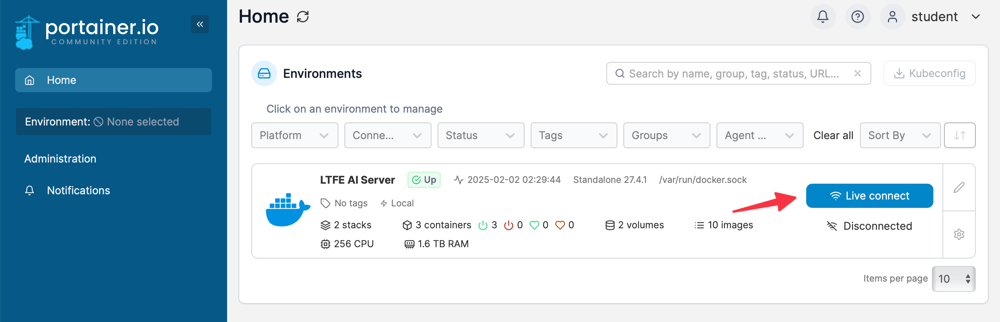

With your environment selected navigate to `Templates` -> `Custom` and click on the predefined template.

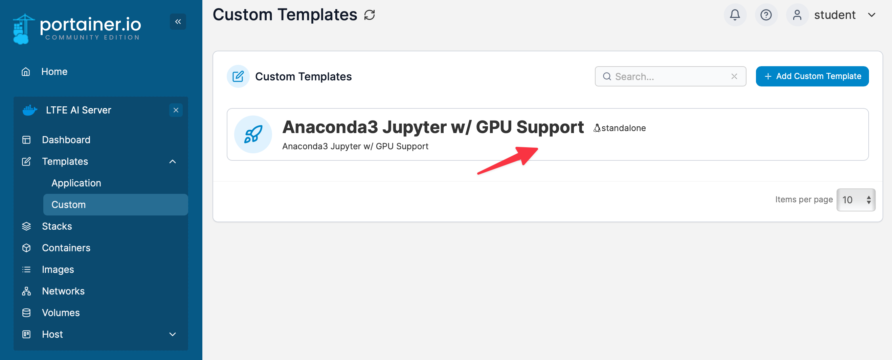

Then fill out the configuration of your deployment. If working in the privileged shared environment, make sure to click on `+ Customize stack` option and change the exposed service port from the default `9999` to a desired port within the range assigned to your account (review the assignment table). Afterwards, click on `Deploy the stack`. Your service should be deployed within seconds to minutes.

### Accessing Jupyter in LTFE Lab Environment

To access the JupyterLab web UI of your deployed service navigate to `http://<LTFE_AI_SERVER_IP>:<YOUR_PORT>`. You should be greeted with the following screen:

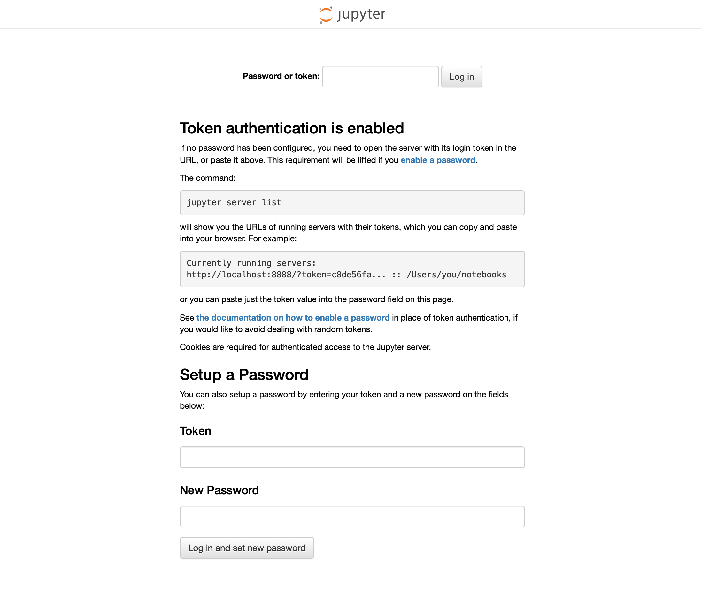

To setup a password for your new environment, you should provide the token of your server. To acquire it open the Portainer web UI and navigate to `Stacks` and select your deployment.

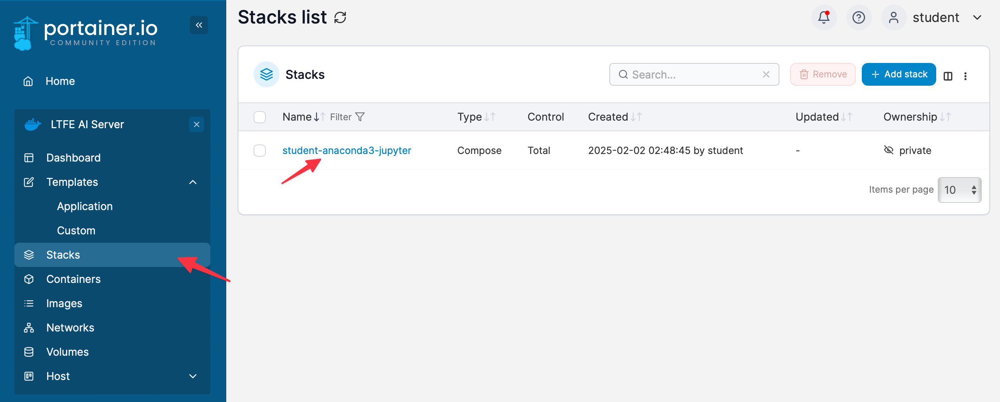

Then click on the `Logs` icon of the `Container` deployed within the `Stack`.

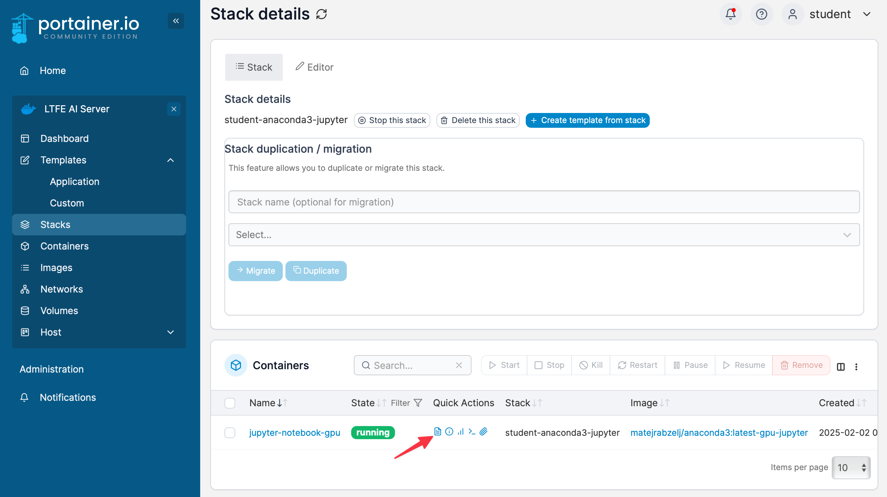

Copy the token displayed in the container log and input it into the `Token` field in the JupyterLab web UI. Likewise, select your desired password and enter it under the `New Password` filed.

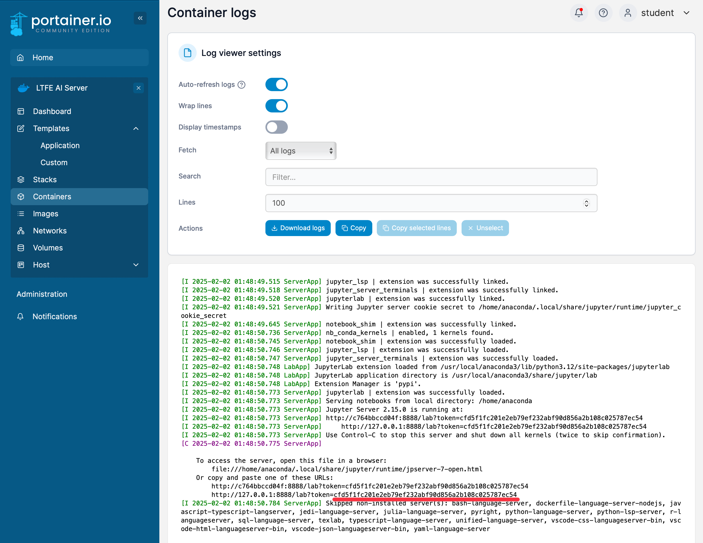

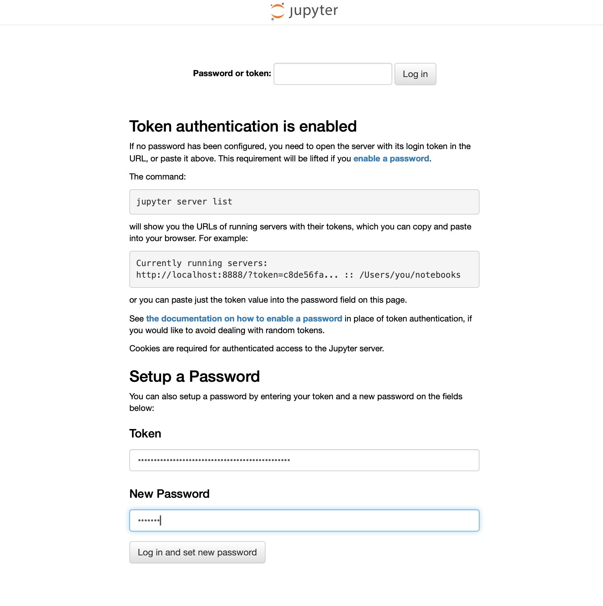

### Installing PyTorch and TensorFlow

You should now be able to access your JupyterLab instance. You may now create a new `Jupyter Notebook`, enter a `Python Console` or access the running container's `Shell`.

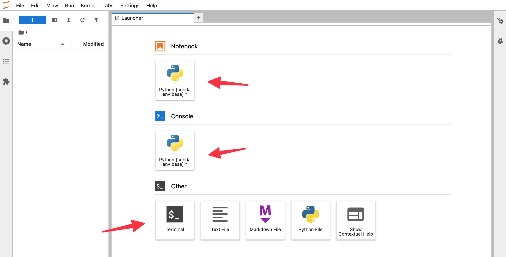

Create a new notebook and enter `!nvidia-smi` into the interactive field. Run the entered command using `Shift+Enter` key combination. The available GPU(s) should be listed.

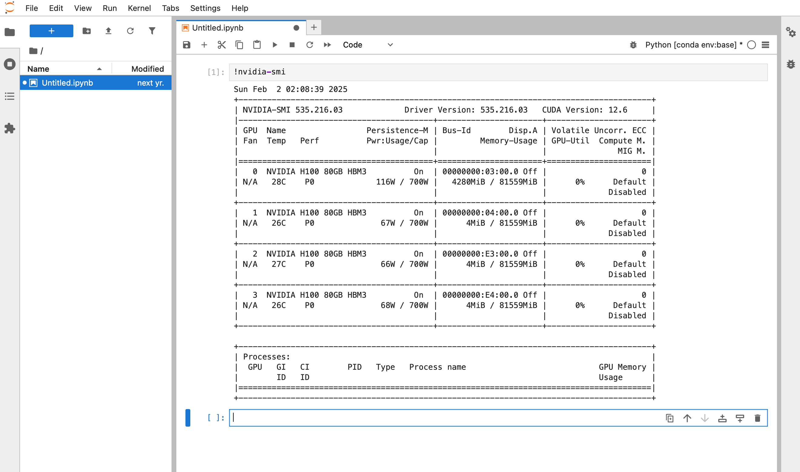

Determine the requirements for your project. You will most likely be working either using [PyTorch](https://pytorch.org/get-started/locally/) or [TensorFlow](https://www.tensorflow.org/install).

#### PyTorch

PyTorch should be installed using `pip3` package manager. To install it for the CUDA version used in this conatiner, enter the command below:

```python
!pip3 install torch torchvision torchaudio --index-url https://download.pytorch.org/whl/cu126
```

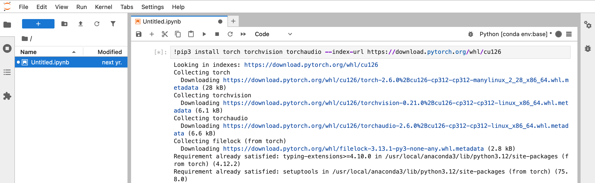

Then verify your installation using the following script

```python
import torch

# Print PyTorch version
print("🔥 PyTorch version:", torch.__version__)

# Check if CUDA (GPU) is available
gpu_available = torch.cuda.is_available()
print("🔍 CUDA Available:", gpu_available)

# Print GPU details if available
if gpu_available:
    print("🚀 GPU Name:", torch.cuda.get_device_name(0))
    print("🖥️ GPU Count:", torch.cuda.device_count())
    print("⚡ CUDA Version:", torch.version.cuda)
else:
    print("❌ No GPU detected! PyTorch is running on CPU.")
```

You should see the following output:

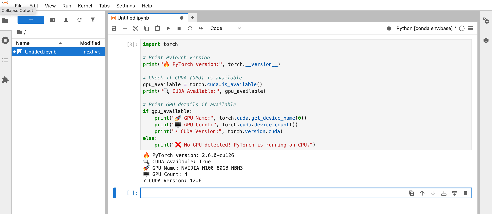

#### TensorFlow

TensorFlow should be installed using `conda`. To install it, run the following command:

```python
!conda install -y tensorflow-gpu
```

Alternatively you may install TensorFlow using `pip3`:

```python
!pip3 install tensorflow
```

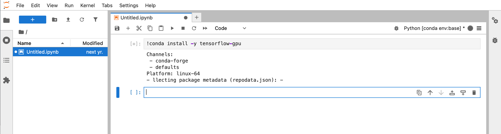

Additionally, run the following script after installation to prevent warning messages from appearing when running TensorFlow:

```python
import os

# Disable oneDNN optimizations (optional)
os.environ["TF_ENABLE_ONEDNN_OPTS"] = "0"

# Force TensorFlow to use specific CUDA libraries
os.environ["TF_CPP_MIN_LOG_LEVEL"] = "2"
os.environ["XLA_FLAGS"] = "--xla_gpu_cuda_data_dir=/usr/local/cuda"

import tensorflow as tf
print("✅ TensorFlow Environment Variables Set")
```

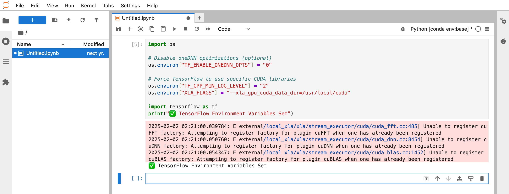

Lastly, verify TensorFlow installation with the following script:

```python
import tensorflow as tf

# Print TensorFlow version
print("🔥 TensorFlow version:", tf.__version__)

# Check if TensorFlow detects GPUs
gpus = tf.config.list_physical_devices("GPU")
if gpus:
    print("✅ GPU is available:", gpus)
    for i, gpu in enumerate(gpus):
        details = tf.config.experimental.get_device_details(gpu)
        print(f"🚀 GPU {i}: {gpu.name}, Compute Capability: {details.get('compute_capability', 'Unknown')}")
else:
    print("❌ No GPU found! TensorFlow is running on CPU.")

```

You should see an output similar to the image below.

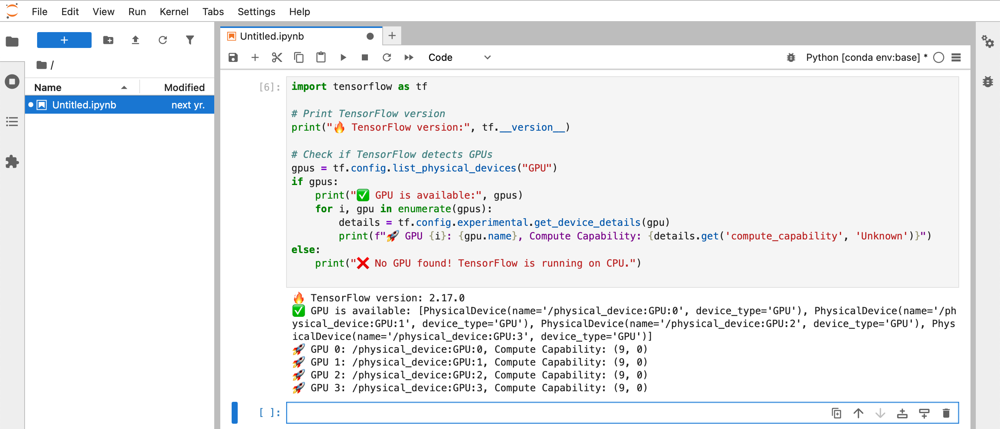

> Note: only your notebooks, pip and conda packages will be preserved across container restarts; other system changes will be discarded in the event of container restart or crash.

Happy hacking!

## Building the containers

To build either a GPU-enabled container or without GPUs, use the [matejrabzelj/anaconda3-jupyter-docker](https://github.com/matejrabzelj/anaconda3-jupyter-docker) GitHub repository.

```bash
git clone git://github.com/matejrabzelj/anaconda3-jupyter-docker.git
```

### Vanilla Anaconda and Jupyter

The base container, based on the `ubuntu:latest` from [Ubuntu](https://hub.docker.com/_/ubuntu/) running Tini shell:

```bash
docker build -t anaconda3:latest -f Dockerfile .
```

With Jupyter Notebooks server pre-installed, build with:

```bash
docker build -t anaconda3:latest-jupyter -f Dockerfile.jupyter .
```

### Anaconda and Jupyter with NVIDIA/CUDA GPU support

```bash
docker build -t anaconda3:latest-gpu -f Dockerfile.nvidia .
```

With Jupyter Notebooks server pre-installed, build with:

```bash
docker build -t anaconda3:latest-gpu-jupyter -f Dockerfile.nvidia-jupyter .
```

## Environment

The default environment uses the following configurable options:

```bash
ANACONDA_DIST="Miniconda3"
ANACONDA_PYTHON="py312"
ANACONDA_CONDA="24.11.3"
ANACONDA_OS="Linux"
ANACONDA_ARCH="x86_64"
ANACONDA_FLAVOR="Miniforge3"
ANACONDA_PATCH="0"
ANACONDA_VERSION="$ANACONDA_DIST-$ANACONDA_PYTHON_$ANACONDA_CONDA-$ANACONDA_OS-$ANACONDA_ARCH"
ANACONDA_ENV="base"
ANACONDA_GID="100"
ANACONDA_PATH="/usr/local/anaconda3"
ANACONDA_UID="1100"
ANACONDA_USER="anaconda"
HOME=/home/$ANACONDA_USER
LANG=en_US.UTF-8
LANGUAGE=en_US.UTF-8
LC_ALL=en_US.UTF-8
SHELL=/bin/bashs
```

## References

- [xychelsea/anaconda3-docker](https://github.com/xychelsea/anaconda3-docker)
- [Anaconda 3](https://www.anaconda.com/blog/tensorflow-in-anaconda)
- [conda-forge](https://conda-forge.org/)
