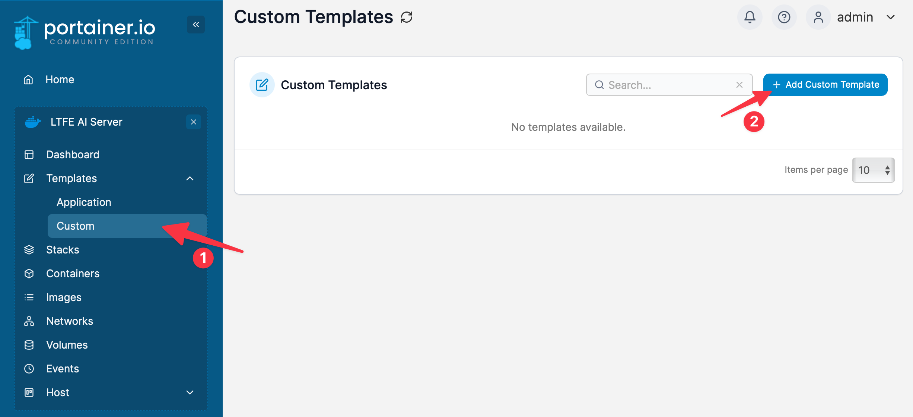
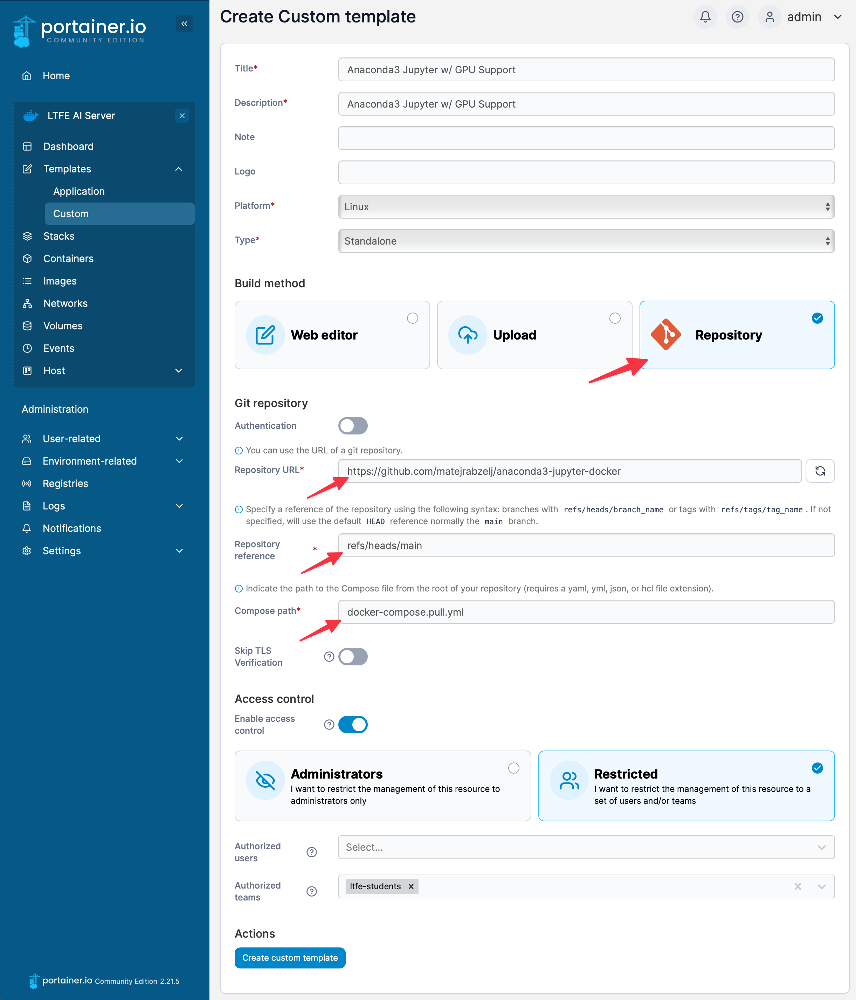

# GPU-enabled Anaconda3 and JupyterLab Docker Containers

## About

GPU-enabled Docker containers with Anaconda 3 and Jupyter Lab for students wanting to run their instances using Portainer on LTFE AI Server. Skip to [Running on Portainer](##running-on-portainer) section for quick start.

Note:

> ⚡ This project is a fork of [xychelsea/anaconda3-docker](https://github.com/xychelsea/anaconda3-docker).
> Small dependency version updates have been made to adapt it for students lab use in early 2025.

Current version:

> Currently uses Ubuntu 24.04, CUDA 12.6, Python 3.12, and Conda 24.11.3.

### What is this?

Provides an [NVIDIA GPU-enabled](https://hub.docker.com/r/nvidia/cuda) container with a lightweight (Miniconda) [Anaconda](https://anaconda.com/) installation. Anaconda is an open data science platform based on Python 3. This container installs Anaconda into the `/usr/local/anaconda` directory. The default user, `anaconda` runs a [Tini shell](https://github.com/krallin/tini/) `/usr/bin/tini`, and comes preloaded with the `conda` command in the environment `$PATH`. Additional versions with [NVIDIA/CUDA](https://hub.docker.com/r/nvidia/cuda/) support and [Jupyter Notebooks](https://jupyter.org/) tags are available.

### What does it feature?

This container enables the `conda` command with a lightweight version of Anaconda (Miniconda) and the `conda-forge` [repository](https://conda-forge.org/) in the `/usr/local/anaconda` directory. The default user, `anaconda` runs a [Tini shell](https://github.com/krallin/tini/) `/usr/bin/tini`, and comes preloaded with the `conda` command in the environment `$PATH`. Additional versions with [NVIDIA/CUDA](https://hub.docker.com/r/nvidia/cuda/) support and [Jupyter Notebooks](https://jupyter.org/) tags are available.

### What about GPU support?

Two flavors provide an [NVIDIA GPU-enabled](https://hub.docker.com/r/nvidia/cuda) container with [Anaconda](https://anaconda.com/).

## Getting the containers

### Vanilla Anaconda and Jupyter

The base container, based on the `ubuntu:latest` from [Ubuntu](https://hub.docker.com/_/ubuntu/) running a Tini shell. For the container with a `/usr/bin/tini` entry point, use:

```bash
docker pull matejrabzelj/anaconda3:latest
```

With Jupyter Notebooks server pre-installed, pull with:

```bash
docker pull matejrabzelj/anaconda3:latest-jupyter
```

### Anaconda and Jupyter with NVIDIA/CUDA GPU support

Modified version of `nvidia/cuda:latest` container, with support for NVIDIA/CUDA graphical processing units through the Tini shell. For the container with a `/usr/bin/tini` entry point:

```bash
docker pull matejrabzelj/anaconda3:latest-gpu
```

With Jupyter Notebooks server pre-installed, pull with:

```bash
docker pull matejrabzelj/anaconda3:latest-gpu-jupyter
```

## Running the containers

### Running using Docker CLI

To run the containers with the generic Docker application or NVIDIA enabled Docker, use the `docker run` command. Make sure you have installed the [NVIDIA driver](https://docs.nvidia.com/cuda/cuda-installation-guide-linux/) and [NVIDIA Container Toolkit](https://github.com/NVIDIA/nvidia-container-toolkit) beforehand.

#### Vanilla Anaconda and Jupyter

```bash
docker run --rm -it matejrabzelj/anaconda3:latest
```

With Jupyter Notebooks server pre-installed, run with:

```bash
docker run --rm -it -d -p 8888:8888 matejrabzelj/anaconda3:latest-jupyter
```

#### Anaconda and Jupyter with NVIDIA/CUDA GPU support

```bash
docker run --gpus all --rm -it matejrabzelj/anaconda3:latest-gpu /bin/bash
```

With Jupyter Notebooks server pre-installed, run with:

```bash
docker run --gpus all --rm -it -d -p 8888:8888 matejrabzelj/anaconda3:latest-gpu-jupyter
```

## Running using Compose

You can run the desired containers using the provided `docker-compose.*.yml` sample files. The `docker-compose.build.yml` will build the `anaconda-jupyter-gpu` service using the local `Dockerfil.nvidia.jupyter`, while the `docker-compose.pull.yml` will pull the `matejrabzelj/anaconda3:latest-gpu-jupyter` image from the Docker Hub.

For example:

```bash
docker compose -f docker-compose.pull.yml up
```

## Running on Portainer

### Adding a Portainer Template (Optional)

You can create a service template in Portainer using the `docker-compose.pull.yml` file from this repository. To do so, navigate to `Templates` -> `Custom` under your selected `Environment` in the Portainer web UI and select `+ Add a Custom Template`:



Populate the required fields and select Repository as the Build Method. Enter the URL of this repository `https://github.com/matejrabzelj/anaconda3-jupyter-docker`, specify `refs/heads/main` as the `Repository reference` and select the desired `docker-compose.pull.yml` file under the `Compose path`.



Specify the desired `Access control` settings and click on `Create custom template`.

### Deploying a New Stack

### Accessing Jupyter in LTFE Lab Environment

### Installing PyTorch and TensorFlow

## Building the containers

To build either a GPU-enabled container or without GPUs, use the [matejrabzelj/anaconda3-jupyter-docker](https://github.com/matejrabzelj/anaconda3-jupyter-docker) GitHub repository.

```bash
git clone git://github.com/matejrabzelj/anaconda3-jupyter-docker.git
```

### Vanilla Anaconda and Jupyter

The base container, based on the `ubuntu:latest` from [Ubuntu](https://hub.docker.com/_/ubuntu/) running Tini shell:

```bash
docker build -t anaconda3:latest -f Dockerfile .
```

With Jupyter Notebooks server pre-installed, build with:

```bash
docker build -t anaconda3:latest-jupyter -f Dockerfile.jupyter .
```

### Anaconda and Jupyter with NVIDIA/CUDA GPU support

```bash
docker build -t anaconda3:latest-gpu -f Dockerfile.nvidia .
```

With Jupyter Notebooks server pre-installed, build with:

```bash
docker build -t anaconda3:latest-gpu-jupyter -f Dockerfile.nvidia-jupyter .
```

## Environment

The default environment uses the following configurable options:

```bash
ANACONDA_DIST="Miniconda3"
ANACONDA_PYTHON="py312"
ANACONDA_CONDA="24.11.3"
ANACONDA_OS="Linux"
ANACONDA_ARCH="x86_64"
ANACONDA_FLAVOR="Miniforge3"
ANACONDA_PATCH="0"
ANACONDA_VERSION="$ANACONDA_DIST-$ANACONDA_PYTHON_$ANACONDA_CONDA-$ANACONDA_OS-$ANACONDA_ARCH"
ANACONDA_ENV="base"
ANACONDA_GID="100"
ANACONDA_PATH="/usr/local/anaconda3"
ANACONDA_UID="1100"
ANACONDA_USER="anaconda"
HOME=/home/$ANACONDA_USER
LANG=en_US.UTF-8
LANGUAGE=en_US.UTF-8
LC_ALL=en_US.UTF-8
SHELL=/bin/bashs
```

## References

- [xychelsea/anaconda3-docker](https://github.com/xychelsea/anaconda3-docker)
- [Anaconda 3](https://www.anaconda.com/blog/tensorflow-in-anaconda)
- [conda-forge](https://conda-forge.org/)
